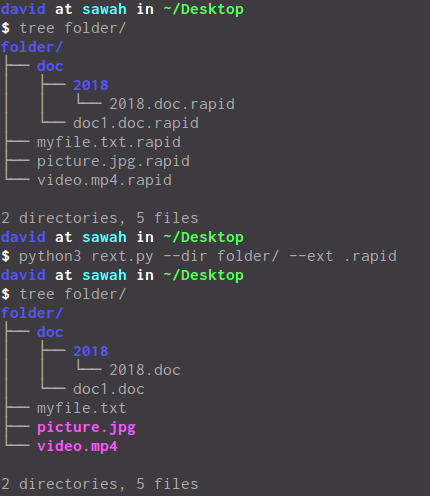

# Rext - Remove Extension
Rext is a python script to remove all extension on your file system.

## Usage

```shell
$ python3 rext.py -h
```

usage: rext.py [-h] [-d DIR] [-e EXT]

optional arguments:  
  -h, --help         show this help message and exit  
  -d DIR, --dir DIR  directory of file(s)  
  -e EXT, --ext EXT  extension to be removed  

## Example
```shell
$ python3 rext.py --dir exampledir/ --ext .rapid
```
or

```shell
$ python3 rext.py -d exampledir/ -e .rapid
```

## Screenshoot



## Thanks to 
- https://docs.python.org/3/howto/argparse.html
-http://www.diveintopython.net/functional_programming/finding_the_path.html
- https://stackoverflow.com/questions/431684/how-do-i-cd-in-python
- https://stackoverflow.com/questions/37014760/recursively-rename-file-extensions